# Veldt

**A local + self-hosted music player for Android — with the Veldt Wisp pill built in.**

> ⚠️ **Public beta.** 0.9.0 is a beta. The local library, browse, now-playing, playlists,
> folders, settings, OpenSubsonic servers, lyrics, scrobbling and the built-in pill are in.
> Expect rough edges, and please report them. See [CHANGELOG.md](CHANGELOG.md) for what's in it.

Veldt is the full-player companion to [**Veldt Wisp**](https://github.com/kaislate/veldt-wisp)
(the standalone One UI-style now-playing pill). Where Veldt Wisp rides *any*
app's media session, Veldt has its own playback engine and library, and bundles
the same pill as a built-in feature.

- **Playback:** Media3 `ExoPlayer` inside a `MediaLibraryService`, so Veldt is a
  proper MediaSession *producer* (audio focus, becoming-noisy, an auto-generated
  media notification, and later Android Auto / Assistant for free).
- **The seam:** Veldt mirrors its own player state into the same `MediaSessionBus`
  the pill overlay reads — so the pill can reflect Veldt's playback directly, with
  no notification-listener permission needed.
- **Planned:** a Jellyfin backend alongside OpenSubsonic.

Like Veldt Wisp, Veldt is **pure Kotlin/Compose with no native code we author**
(Media3 decodes via the platform `MediaCodec`), so it runs on 32-bit and modern
arm64 devices alike.

## Screenshots

| Songs | Albums | Artist |
|:---:|:---:|:---:|
| 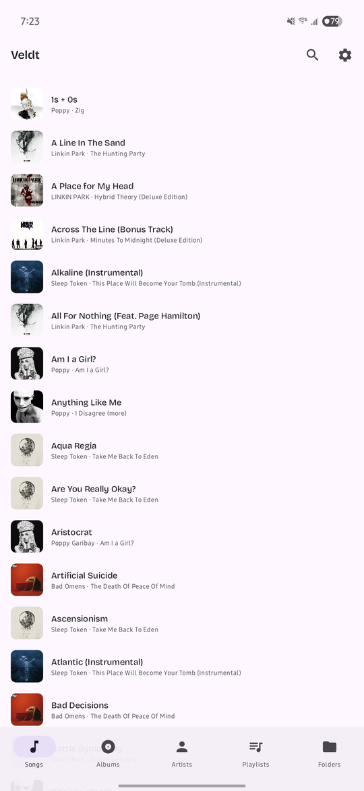 | 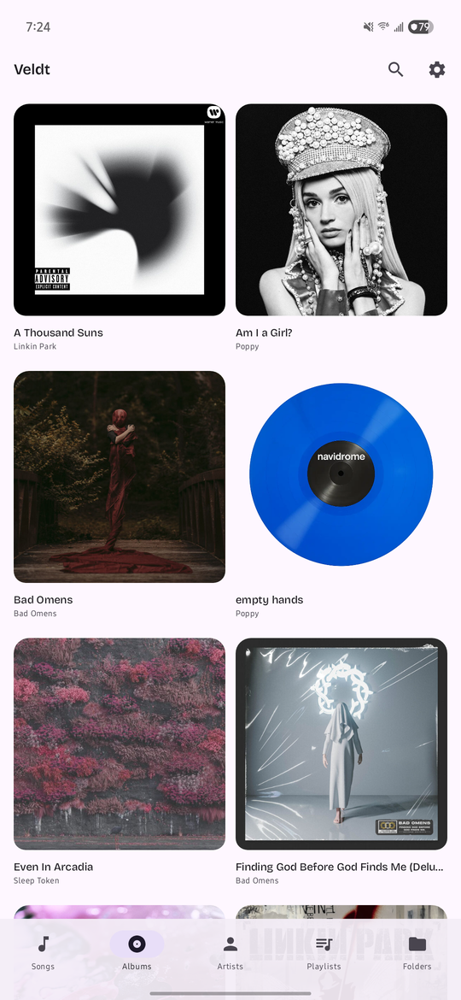 | 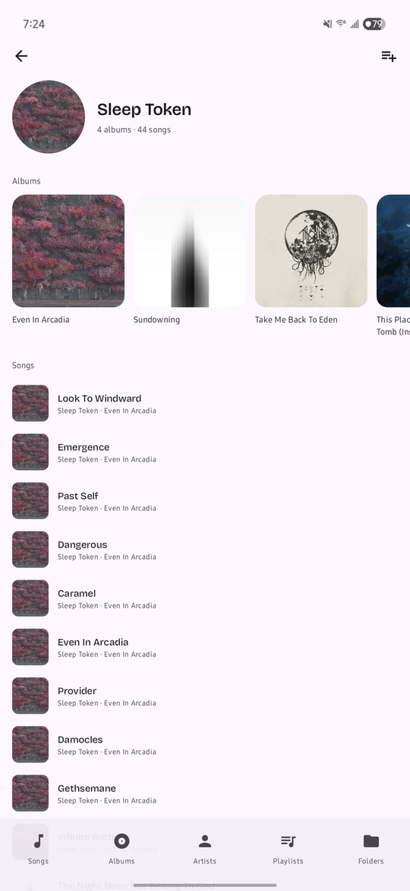 |

| Now playing | Now playing, dark | Synced lyrics |
|:---:|:---:|:---:|
| 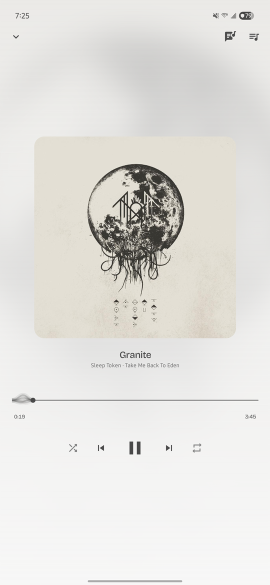 | 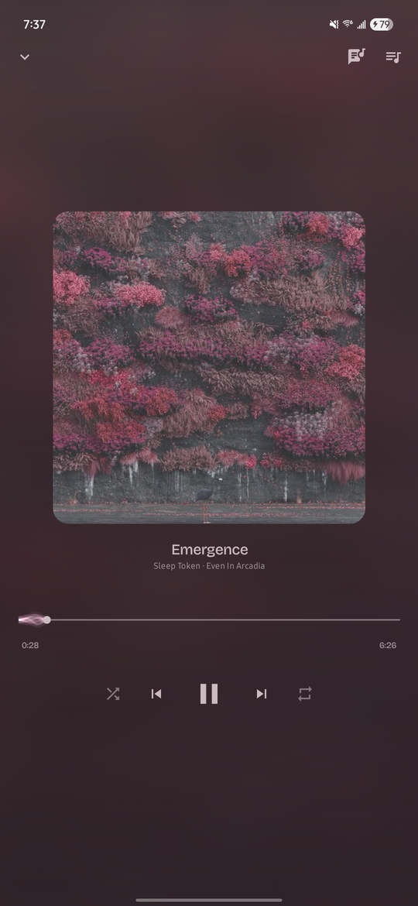 | 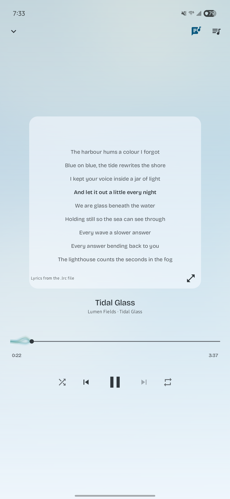 |

| Search | Folders | Settings |
|:---:|:---:|:---:|
| 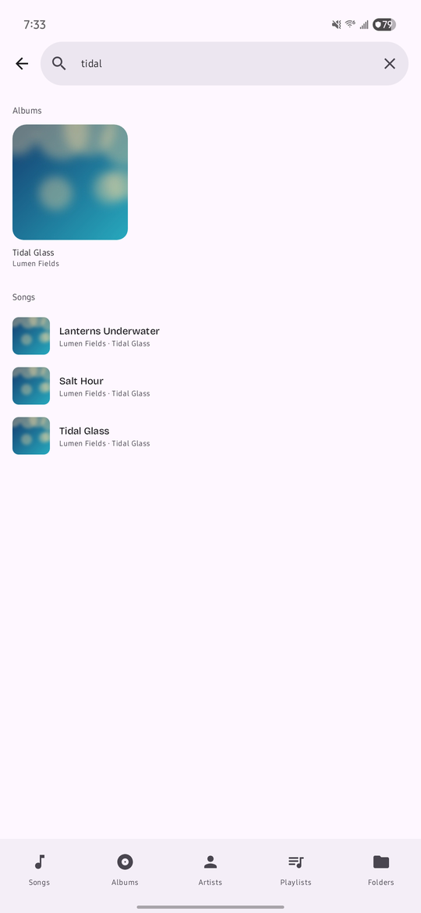 | 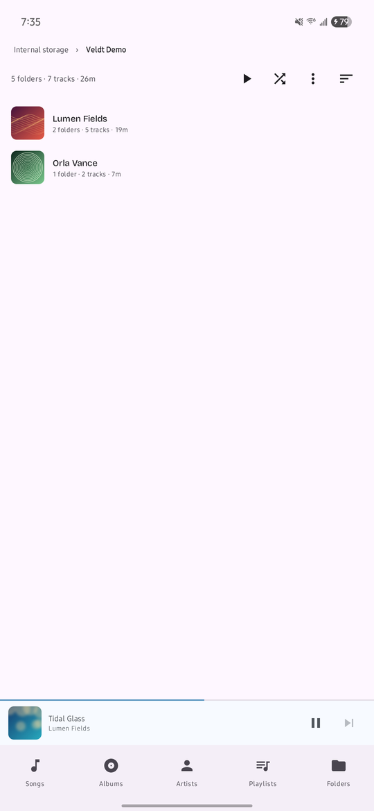 | 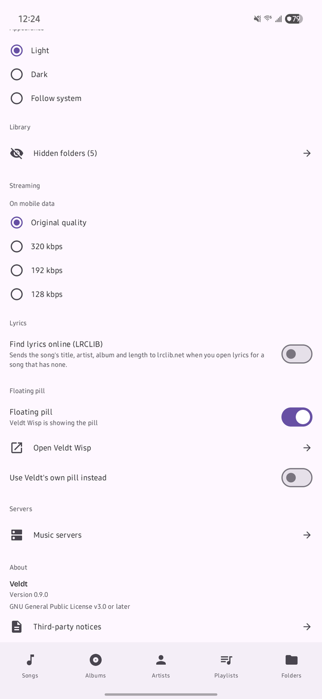 |

**The built-in pill**, over the home screen, and expanded into its card:

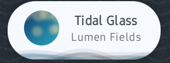 &nbsp; 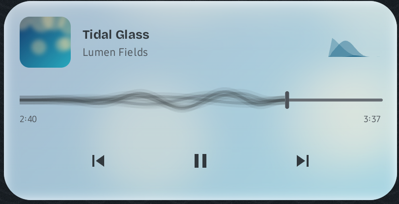

<sub>Library screenshots show a Navidrome server's catalogue. The search, folders, lyrics and pill
shots use a small demo library made for these screenshots: fictional artists, generated artwork
and original lyrics.</sub>

## Status — what works today

- **Playback.** A Media3 `PlaybackService` with audio focus, a media notification,
  and background playback via a `mediaPlayback` foreground service. A
  `PlayerBusAdapter` mirrors player state into `MediaSessionBus`, which is the seam
  the built-in pill reads.
- **Library.** On-device scan via `MediaStore`, augmented with eAlvaTag tag reading,
  stored in Room and kept live by a `MediaStore` observer.
- **Browse and now-playing.** Songs / albums / artists / search, an album-art
  backdrop with a palette extracted from the current artwork, and a scrub bar. Search
  opens fresh each time, and its clear button always clears.
- **Playlists.** Create, reorder, add from browse, and `.m3u` / `.m3u8` import.
  Entries are keyed on a rescan-stable source identity, so a track that moves — or a
  volume that remounts — re-links itself instead of going permanently blank.
- **Folders.** Browse the library as it sits on disk, across internal storage and SD
  cards, with audiobooks and podcasts included. Long-press a folder to hide it from the
  library: its songs leave Songs, Albums, Artists and search, but it stays browsable and
  playable in Folders, and Settings lists the hidden folders to show again. Long-press a
  storage volume to rename it.
- **Settings.** Light / Dark / Follow-system theme, with now-playing colours solved for
  legible contrast against the artwork actually on screen. The launch window follows the
  chosen theme, so Light no longer opens on a dark frame.
- **Built-in pill.** Veldt Wisp's floating now-playing pill for Veldt's own playback: it
  appears when you leave Veldt while music plays and expands into a card with the artwork,
  a scrub bar and transport. Floating pill settings: one switch, with Veldt Wisp detected
  automatically and a link to get it. The pill's look (anchor, width, wave style and colour,
  hide delay, buttons) is configurable. Needs "Display over other apps". On Android 13–14
  the pill no longer blocks taps around it.
- **Servers.** Add an OpenSubsonic server (tested against Navidrome), test the
  connection, and store the password encrypted with an Android Keystore key. Plain
  `http://` is allowed for LAN and Tailscale setups, with a warning as you type it. The
  server's library syncs into the same browse screens and streams, with its cover art.
  Playlist entries re-link when a server's track ids change.
- **Lyrics.** Synced or plain lyrics from a sidecar `.lrc` file, the file's own tags, or
  the server, plus an opt-in online lookup (LRCLIB) that is off by default.
- **Scrobbling.** Plays are scrobbled to the server, with an offline queue that retries
  when the server is unreachable.

## Requirements

- Android 10+ (API 29)

## Install

0.9.0 is a beta.

- Download the APK from [GitHub Releases](https://github.com/kaislate/Veldt/releases). Beta
  builds are marked as pre-releases.
- For updates, add the repo to [Obtainium](https://github.com/ImranR98/Obtainium) and allow
  pre-releases. Veldt itself never checks for updates: it makes no network requests you
  haven't set up.

## Build

```
git clone https://github.com/kaislate/Veldt.git
cd Veldt
./gradlew assembleDebug
```

Requires JDK 17+ and the Android SDK (compileSdk 36). Release builds are signed
with a local keystore via an untracked `key.properties`; without it,
`assembleRelease` produces an unsigned APK.

## Credits & license

Veldt is the sibling of [**Veldt Wisp**](https://github.com/kaislate/veldt-wisp)
(same author) and shares its design language. Some of Veldt's code is **ported from Veldt
Wisp**, which is also GPL-3.0-or-later; each ported file says so in its header:

- **The wave renderers** — `ui/components/WaveStyles.kt` and `ui/components/HillsWave.kt`,
  ported near-verbatim in P1.3 (used by the now-playing scrub bar and the pill).
- **The built-in pill** — the overlay window, the pill and its expanded card, and the rules
  that decide when it shows and hides (under `app/src/main/java/com/kaislate/veldtplayer/pill/`,
  plus its status-bar icon `res/drawable/ic_stat_pill.xml`), ported in P1.5c.

The rest of Veldt is original work. The two other files once shared with Veldt Wisp (the
palette extractor and the media-session bus) were rewritten clean-room during Veldt's own
development. Distributed under the GNU General Public License v3.0 or later
— see [LICENSE](LICENSE). If you distribute a modified version, it must carry the
same licence and ship its source.

Bundled third-party assets: the [Bricolage Grotesque](https://github.com/ateliertriay/bricolage)
typeface, under the SIL Open Font License 1.1 — see
[licenses/bricolage-grotesque-OFL.txt](licenses/bricolage-grotesque-OFL.txt).
